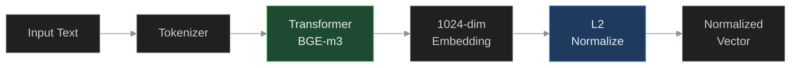
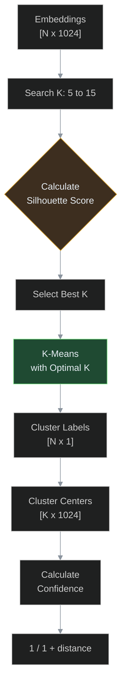
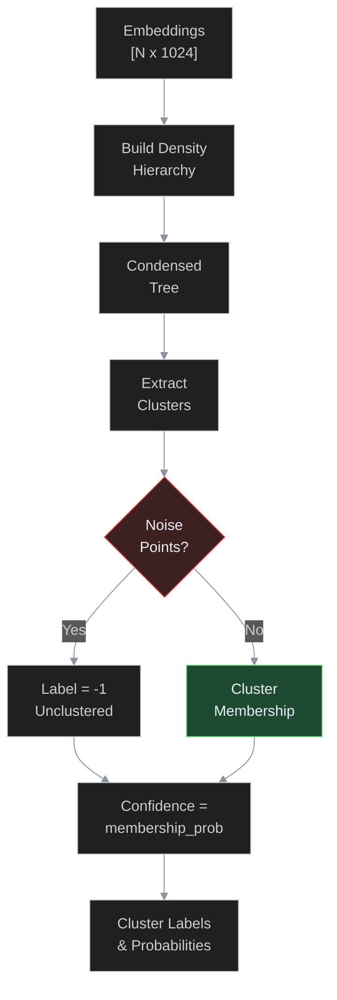
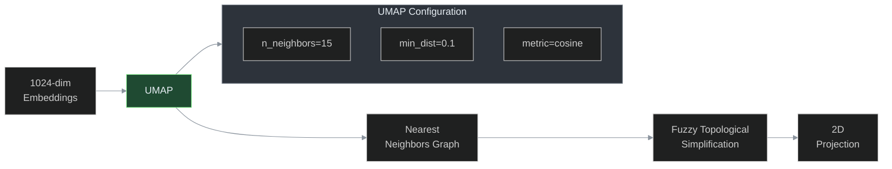
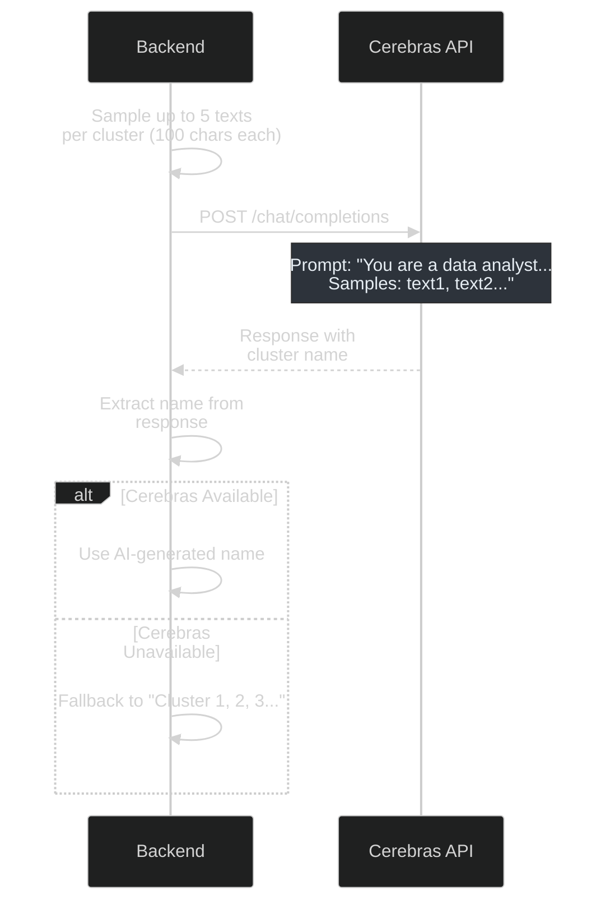
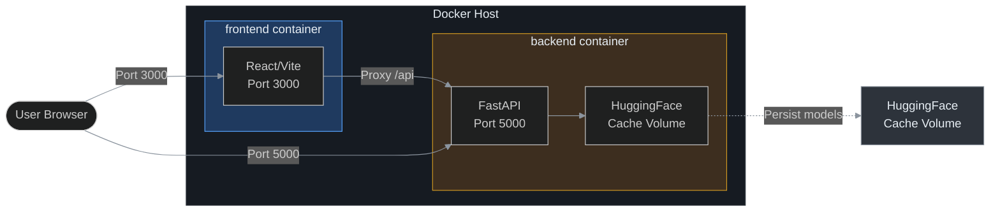

# Natural Language Clustering

<!-- Dark mode optimized styles -->
<style>
  :root {
    --dm-bg: #0d1117;
    --dm-bg-secondary: #161b22;
    --dm-border: #30363d;
    --dm-text: #e6edf3;
    --dm-text-secondary: #8b949e;
    --dm-accent-blue: #58a6ff;
    --dm-accent-green: #7ee787;
    --dm-accent-yellow: #d29922;
    --dm-accent-red: #f85149;
  }
  @media (prefers-color-scheme: dark) {
    body, body { background-color: var(--dm-bg); color: var(--dm-text); }
    table { border-color: var(--dm-border); }
    th, td { border-color: var(--dm-border); background: var(--dm-bg-secondary); color: var(--dm-text); }
    code, pre { background: var(--dm-bg-secondary); color: var(--dm-text); border-color: var(--dm-border); }
    a { color: var(--dm-accent-blue); }
    h1, h2, h3, h4 { color: var(--dm-text); }
  }
</style>

An intelligent semantic text clustering and visualization application that groups similar texts together using state-of-the-art embedding models and clustering algorithms, presented through an interactive 2D visualization.

## Table of Contents

- [Overview](#overview)
- [Architecture](#architecture)
- [Technologies](#technologies)
- [Clustering Mechanisms](#clustering-mechanisms)
- [Project Structure](#project-structure)
- [Configuration](#configuration)
- [Docker Compose Setup](#docker-compose-setup)
- [Development](#development)
- [API Reference](#api-reference)
- [Environment Variables](#environment-variables)

---

## Overview

This application performs semantic text clustering by:

1. **Embedding**: Converting text into dense vector representations using the BGE-m3 transformer model
2. **Clustering**: Grouping similar texts using either K-Means or HDBSCAN algorithms
3. **Visualization**: Projecting high-dimensional vectors to 2D using UMAP for interactive visualization
4. **Naming**: Auto-generating descriptive cluster names using Cerebras AI

---

## Architecture

```mermaid
%%{init: {'theme': 'dark', 'themeVariables': { 'primaryColor': '#58a6ff', 'primaryTextColor': '#e6edf3', 'lineColor': '#8b949e' }} }%%
graph TB
    subgraph Frontend["Frontend (React) - Port 3000"]
        A[Input Panel] -->|User Input| B[Redux Store]
        C[Cluster Chart] -->|Visualization| B
        D[Properties Panel] -->|Cluster Details| B
    end

    B -->|HTTP /api/*| E

    subgraph Backend["Backend (FastAPI) - Port 5000"]
        E[API Routes] --> F[/api/cluster]
        E --> G[/api/sample]
        E --> H[/health]

        F --> I[Embedder Service]
        F --> J[Clusterer Service]
        F --> K[Namer Service]

        I -->|BGE-m3| L[1024-dim Vectors]
        J -->|K-Means or HDBSCAN| M[Cluster Labels]
        K -->|Cerebras AI| N[Cluster Names]
    end

    style Frontend fill:#1f3a5f,stroke:#58a6ff,color:#e6edf3
    style Backend fill:#3d2e1f,stroke:#d29922,color:#e6edf3
    style I fill:#1f4a32,stroke:#7ee787,color:#e6edf3
    style J fill:#1f4a32,stroke:#7ee787,color:#e6edf3
    style K fill:#1f4a32,stroke:#7ee787,color:#e6edf3
```

### Data Flow

```mermaid
%%{init: {'theme': 'dark', 'themeVariables': { 'primaryColor': '#58a6ff', 'secondaryColor': '#7ee787', 'lineColor': '#8b949e', 'tertiaryColor': '#d29922' }} }%%
flowchart LR
    A["User Input<br/>Texts"] --> B["1. Embedding<br/>BGE-m3 Model"]
    B --> C["1024-dim<br/>Vectors"]
    C --> D["2. Clustering<br/>K-Means or HDBSCAN"]
    D --> E["Cluster<br/>Labels"]
    E --> F["3. UMAP<br/>Projection"]
    F --> G["2D<br/>Coordinates"]
    G --> H["4. Normalization<br/>MinMaxScaler"]
    H --> I["[0, 1]<br/>Normalized"]
    I --> J["5. Cluster Naming<br/>Groq AI"]
    J --> K["Descriptive<br/>Names"]
    K --> L["Visualization<br/>Data"]

    style B fill:#1f4a32,stroke:#7ee787,color:#e6edf3
    style D fill:#1f4a32,stroke:#7ee787,color:#e6edf3
    style F fill:#1f4a32,stroke:#7ee787,color:#e6edf3
    style H fill:#1f4a32,stroke:#7ee787,color:#e6edf3
    style J fill:#1f4a32,stroke:#7ee787,color:#e6edf3
```



---

## Technologies

### Backend

| Technology | Version | Purpose |
|------------|---------|---------|
| **FastAPI** | 0.109.0 | Async web framework |
| **Uvicorn** | 0.27.0 | ASGI server |
| **sentence-transformers** | 2.3.1 | Text embedding generation |
| **transformers** | 4.36.2 | HuggingFace transformer models |
| **huggingface-hub** | 0.20.3 | Model caching and downloading |
| **PyTorch** | CPU | Deep learning tensor operations |
| **scikit-learn** | 1.4.0 | K-Means clustering, silhouette scoring |
| **UMAP** | 0.5.5 | Dimensionality reduction |
| **HDBSCAN** | 0.8.1 | Density-based clustering |
| **Cerebras SDK** | Latest | AI-powered cluster naming |
| **NumPy** | 1.26.3 | Numerical computations |
| **Pandas** | 2.2.0 | Data manipulation |

### Frontend

| Technology | Version | Purpose |
|------------|---------|---------|
| **React** | 18.2.0 | UI framework |
| **Redux Toolkit** | 1.9.5 | State management |
| **Plotly.js** | 2.26.0 | Interactive visualization |
| **react-plotly.js** | 2.6.0 | React bindings for Plotly |
| **Axios** | 1.5.0 | HTTP client |
| **Vite** | 5.0.0 | Build tool and dev server |
| **TailwindCSS** | 3.3.5 | CSS framework |

### Infrastructure

| Technology | Purpose |
|------------|---------|
| **Docker** | Containerization |
| **Docker Compose** | Multi-container orchestration |
| **Micromamba** | Fast conda environment management |
| **Node.js** | Frontend runtime (Alpine) |

---

## Clustering Mechanisms

### 1. Embedding Model: BGE-m3

**Model**: `BAAI/bge-m3` (State-of-the-art multilingual embedding model)

- **Dimensionality**: 1024 dimensions
- **Normalization**: L2 normalization (cosine similarity compatibility)
- **Loading**: Lazy loading on first request (or preloaded with `PRELOAD_EMBEDDING_MODEL=true`)
- **Pattern**: Singleton - model is loaded once and reused across requests



### 2. K-Means Clustering

**Algorithm**: Lloyd's K-Means with scikit-learn implementation

**Optimal K Selection**:
- Searches range `k_min=5` to `k_max=15` (configurable)
- Uses **Silhouette Score** to find optimal K
- Silhouette score measures how similar texts are to their own cluster vs other clusters
- Range: -1 to 1 (higher = better defined clusters)



### 3. HDBSCAN Clustering

**Algorithm**: Hierarchical Density-Based Spatial Clustering of Applications with Noise

**Advantages over K-Means**:
- Automatic cluster detection (no need to specify K)
- Identifies noise points (label = -1)
- Handles clusters of varying densities and shapes



**Noise Handling**:
- Points labeled -1 are grouped into "Unclustered" pseudo-cluster
- Displayed separately in visualization

### 4. UMAP Dimensionality Reduction

**Purpose**: Project 1024-dimensional embeddings to 2D for visualization



### 5. Cluster Naming (Cerebras AI)

**Model**: `gpt-oss-120b` via Cerebras API



---

## Project Structure

```
natural_language_clustering/
├── docker-compose.yml           # Docker orchestration
├── README.md                   # This file
├── AGENTS.md                   # Agent instructions
│
├── backend/
│   ├── Dockerfile              # Backend container definition
│   ├── requirements.txt        # Python dependencies
│   ├── .env                   # Environment variables (CEREBRAS_API_KEY)
│   └── app/
│       ├── main.py            # FastAPI app initialization
│       ├── models/
│       │   └── schemas.py     # Pydantic request/response models
│       ├── routes/
│       │   └── cluster.py      # API endpoints
│       └── services/
│           ├── embedder.py     # BGE-m3 embedding service
│           ├── clusterer.py    # K-Means/HDBSCAN + UMAP
│           └── namer.py        # Cerebras AI cluster naming
│
└── frontend/
    ├── Dockerfile             # Frontend container definition
    ├── package.json           # Node dependencies
    ├── pnpm-workspace.yaml    # pnpm workspace config
    ├── vite.config.js        # Vite config with API proxy
    ├── tailwind.config.js    # Tailwind CSS config
    ├── index.html             # HTML entry point
    └── src/
        ├── App.jsx            # Main React component
        ├── main.jsx           # React entry point
        ├── index.css          # Global styles
        ├── api/
        │   └── clusterApi.js  # API client
        ├── store/
        │   ├── index.js       # Redux store config
        │   └── clusterSlice.js # Redux state management
        └── components/
            ├── ClusterChart.jsx    # Plotly visualization
            ├── InputPanel.jsx      # Text input + options
            ├── PropertiesPanel.jsx # Cluster details + stats
            ├── MobileTabBar.jsx    # Mobile navigation
            ├── BottomSheet.jsx     # Mobile bottom sheet
            └── icons.jsx           # SVG icons
```

---

## Configuration

### Docker Compose Architecture



### Docker Compose Services

#### Backend Service

| Setting | Value | Description |
|---------|-------|-------------|
| Image | Built from `./backend` | Custom Dockerfile |
| Container Name | `backend` | Docker container name |
| Port | `5000:5000` | Host:Container port mapping |
| Environment File | `./backend/.env` | CEREBRAS_API_KEY |
| Volume | `backend-huggingface-cache:/root/.cache/huggingface` | Model cache persistence |
| Health Check | `GET /health` | Container health verification |
| Dependencies | None | Starts independently |

#### Frontend Service

| Setting | Value | Description |
|---------|-------|-------------|
| Image | Built from `./frontend` | Custom Dockerfile |
| Container Name | `frontend` | Docker container name |
| Port | `3000:3000` | Host:Container port mapping |
| Environment | `VITE_API_URL=http://backend:5000` | API endpoint for container-to-container |
| Dependencies | `backend` | Ensures backend starts first |

### Docker Volumes

| Volume | Purpose | Persistence |
|--------|---------|-------------|
| `backend-huggingface-cache` | HuggingFace model cache | Persists across restarts |

**Benefit**: After initial model download, subsequent starts are faster as models are cached.

### Environment Variables

#### Backend (.env)

```bash
# Required
CEREBRAS_API_KEY=your_cerebras_api_key_here

# Optional
PRELOAD_EMBEDDING_MODEL=false  # Set to true to load model at container start
```

#### Frontend (docker-compose.yml)

```bash
VITE_API_URL=http://backend:5000  # Internal Docker network URL
```

---

## Docker Compose Setup

### Prerequisites

1. **Docker** installed (version 20.10+)
2. **Docker Compose** installed (version 2.0+)
3. **Cerebras API Key** from [console.cerebras.ai](https://console.cerebras.ai)

### Quick Start

**Step 1: Clone and navigate to project**

```bash
cd /home/paarth/workspace/natural-language-classification/natural_language_clustering
```

**Step 2: Configure API Key**

Edit `backend/.env`:

```bash
CEREBRAS_API_KEY=your_actual_cerebras_api_key_here
```

**Step 3: Build and start containers**

```bash
docker compose build --no-cache
docker compose up -d
```

**Step 4: Verify services**

```bash
# Check container status
docker compose ps

# View logs
docker compose logs -f

# Health check
curl http://localhost:5000/health
curl http://localhost:3000
```

**Step 5: Access the application**

Open your browser to: **http://localhost:3000**

### Docker Compose Commands

| Command | Description |
|---------|-------------|
| `docker compose up -d` | Start containers in detached mode |
| `docker compose down` | Stop and remove containers |
| `docker compose logs -f` | Follow logs from all services |
| `docker compose logs -f backend` | Follow backend logs only |
| `docker compose restart` | Restart all services |
| `docker compose restart backend` | Restart backend only |
| `docker compose build --no-cache` | Rebuild without cache |
| `docker compose build backend` | Rebuild backend only |
| `docker compose exec backend sh` | Shell into backend container |
| `docker compose exec frontend sh` | Shell into frontend container |
| `docker compose ps` | Show container status |
| `docker compose top` | Show running processes |

### Troubleshooting

#### Container fails to start

```bash
# Check logs
docker compose logs backend
docker compose logs frontend

# Verify .env exists
cat backend/.env
```

#### Model download takes too long

Models are downloaded on first clustering request. To pre-download during build:

```bash
# In backend/Dockerfile, set:
ARG PRELOAD_EMBEDDING_MODEL=true
```

Or manually trigger download:
```bash
docker compose exec backend python -c "from app.services.embedder import get_embedder; get_embedder()"
```

#### Port conflicts

If ports 3000 or 5000 are in use:

```yaml
# In docker-compose.yml, change:
ports:
  - "3001:3000"  # Frontend now on 3001
  - "5001:5000"  # Backend now on 5001
```

#### Out of memory

If running low on memory (model is ~2GB):

```bash
# Set model to not preload
# In backend/.env:
PRELOAD_EMBEDDING_MODEL=false
```

### Production Deployment Considerations

1. **Use production-grade API keys** - Not the development key
2. **Enable CORS restrictions** - Currently allows all origins in development
3. **Add reverse proxy** (nginx) for HTTPS termination
4. **Set resource limits** in docker-compose:
   ```yaml
   deploy:
     resources:
       limits:
         memory: 4G
   ```
5. **Consider GPU acceleration** for embedding (add `--gpus all` to docker compose run)

---

## Development

### Local Development (Without Docker)

**Backend:**

```bash
cd backend
pip install -r requirements.txt
export CEREBRAS_API_KEY=your_api_key
uvicorn app.main:app --reload --port 5000
```

**Frontend:**

```bash
cd frontend
pnpm install
pnpm run dev
```

**Note**: In local dev, Vite proxies `/api` to `localhost:5000`.

### Running Tests

```bash
cd backend
pytest tests/ -v
```

### Adding New Clustering Algorithms

To add a new clustering method (e.g., DBSCAN):

1. **Update `clusterer.py`**:
   ```python
   def cluster_dbscan(self, embeddings, eps=0.5, min_samples=5):
       from sklearn.cluster import DBSCAN
       clustering = DBSCAN(eps=eps, min_samples=min_samples, metric='cosine')
       labels = clustering.fit_predict(embeddings)
       return labels
   ```

2. **Update `schemas.py`** - Add new method to `ClusterMethod` enum

3. **Update `cluster.py`** - Add case for new method in clustering endpoint

---

## API Reference

### POST /api/cluster

Cluster texts and return visualization data.

**Request:**

```json
{
  "texts": [
    "error connecting to database",
    "the cat sat on the mat",
    "database timeout issue",
    "shipping delay notification"
  ],
  "method": "kmeans",
  "n_clusters": 2,
  "min_cluster_size": 5
}
```

| Field | Type | Required | Description |
|-------|------|----------|-------------|
| `texts` | string[] | Yes | List of texts to cluster (min: 4) |
| `method` | string | No | `"kmeans"` or `"hdbscan"` (default: kmeans) |
| `n_clusters` | number | No | Number of clusters for kmeans (5-15 auto, or 1-N manual) |
| `min_cluster_size` | number | No | Min cluster size for hdbscan (default: 5) |

**Response:**

```json
{
  "clusters": [
    {
      "id": "0",
      "name": "Database Issues",
      "size": 2,
      "color": "#3b82f6"
    },
    {
      "id": "1",
      "name": "General",
      "size": 2,
      "color": "#22c55e"
    }
  ],
  "points": [
    {
      "x": 0.25,
      "y": 0.75,
      "cluster": "0",
      "confidence": 0.92,
      "text": "error connecting to database"
    }
  ],
  "stats": {
    "total_points": 4,
    "num_clusters": 2,
    "silhouette_score": 0.85
  }
}
```

### GET /api/sample

Fetch 100 sample texts for demo.

**Response:**

```json
{
  "texts": [
    "text 1...",
    "text 2...",
    "..."
  ]
}
```

### GET /health

Health check endpoint.

**Response:**

```json
{
  "status": "healthy",
  "cerebras_available": true
}
```

---

## Environment Variables

### Backend (.env)

| Variable | Required | Default | Description |
|----------|----------|---------|-------------|
| `CEREBRAS_API_KEY` | Yes | - | API key from console.cerebras.ai |
| `PRELOAD_EMBEDDING_MODEL` | No | `false` | Load model at startup |

### Frontend (docker-compose.yml)

| Variable | Default | Description |
|----------|---------|-------------|
| `VITE_API_URL` | `http://backend:5000` | Backend API URL (Docker network) |

---

## License

MIT
